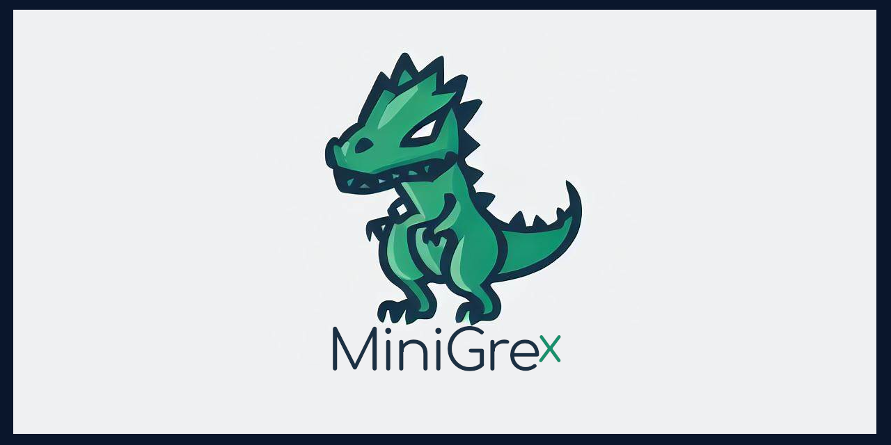

# MiniGreX - Content Management Framework

## Table of Contents
- [Security](#security)
- [Introduction](#introduction)
- [Installation](#installation)
- [Features](#features)
- [Admin Panel](#admin-panel)
- [User Panel](#user-panel)
- [Usage](#usage)
- [Changelog](#changelog)
- [Contributing](#contributing)
- [Credits](#credits)
- [License](#license)

> **IMPORTANT**  
> ⚠️ MiniGreX is still in development. It works, but improvements are ongoing. Want to help? The smallest high-secure multi-CMS for DevOps 👮
> Update 12.06.24 i kill it today. Later! not yet please!

## Security
MiniGreX is designed with security in mind, minimizing the risk of SQL injection and other vulnerabilities. Keep MiniGreX up-to-date with the latest patches and use strong passwords for all accounts.

## Introduction
MiniGreX is a lightweight and secure system "not only" for sharing links, images, videos, and comments. It supports MySQL, MariaDB, and PostgreSQL, and uses PHP PDO with prepared statements for security.

[Documentation for this project](docs/)

## Installation
To install MiniGreX CMS, follow these steps:

1. Install a web server (Apache or Nginx).
2. Install PHP 7.4 or higher.
3. Install MySQL, PostgreSQL, or MariaDB.
4. Clone the repository from GitHub.
5. Create a database for MiniGreX CMS.
6. Import the SQL file `sql.txt` into your database.
7. Update `init.php` with your database credentials.
8. Upload the files to your server.
9. Change file and folder permissions.
10. Navigate to `index.php` to view the CMS.

## Features
- [x] User authentication
- [x] Admin panel for managing site information and user accounts
- [x] Share links, images, and videos
- [x] Comment system
- [x] SQL injection prevention with prepared statements
- [x] Supports MySQL, MariaDB, and PostgreSQL
- [x] Force SSL
- [x] Role Manager
- [x] Caching
- [x] Some "Test tools"
- [ ] Lazyload + Image Customizer 
- [ ] Image & Video Database 
- [ ] SEO Tools
- [ ] Gateway Tools
- [ ] Deep/Dark Web mode
- [ ] Some admin stuff
- [ ] Profile Manager
- [ ] Some secrets 😃

## Admin Panel
The admin panel allows admins to manage site information and user accounts, including:
- Changing site title and description
- Changing admin/user passwords
- Viewing and deleting user accounts
- Managing roles and permissions

## User Panel
The user panel allows users to manage their accounts and content, including:
- Changing user passwords
- Creating posts, links, comments, and uploading images and videos
- Update Profile

## Public Files and Functions
- `login.php` and `register.php` with prepared statements and CSRF protection

## Security Enhancements
- Content Security Policy (CSP) and other security headers
- Enhanced SQL injection prevention with PDO and prepared statements
- CSRF protection mechanisms
- Session security with session regeneration to prevent session fixation

## Modular Architecture
- `plugin_loader.php` for modular plugin integration
- `theme_loader.php` for modular theme integration

## Role Manager
- Manage roles and permissions
- Admins can create, delete, and assign roles to users

## Coming Soon
- Lazyload + Image Customizer
- Image & Video Database
- SEO Tools
- Gateway Tools
- Deep/Dark Web mode for enhanced security and privacy (for DevOps)
- Profile Manager

## Changelog
### Latest Updates 
###### 06/2024
1. **Role Manager**:
    - New plugin for managing roles and permissions.
    - Admins can create, delete, and assign roles to users.

2. **Security Enhancements**:
    - Added Content Security Policy (CSP) and other security headers.
    - Enhanced SQL injection prevention using PDO and prepared statements.
    - Implemented CSRF protection mechanisms.

3. **Session Security**:
    - Added a function to regenerate session IDs to prevent session fixation.

4. **Modular Architecture**:
    - Introduced `plugin_loader.php` for modular integration of plugins.

5. **Improvements in `login.php` and `register.php`**:
    - Usage of PDO and prepared statements.
    - Integration of CSRF protection.

These changes and enhancements significantly improve the security, modularity, and administrative capabilities of the CMS.

## Usage
Once installed, MiniGreX CMS allows you to share links, images, and videos. The main page shows all posts and comments. To add a new post, click "Add Post" and fill in the form.

To comment on a post, log in or register a new account. Admins can change site settings and passwords from the admin panel.

## Contributing

We welcome contributions to MiniGreX CMS, including bug fixes, feature requests, and translations. To contribute, please create a new branch and submit a pull request.

## Support

Your support is greatly appreciated. If you find MiniGreX CMS useful, consider ⭐ the project on GitHub or becoming a [Sponsor](https://github.com/sponsors/volkansah).

## Credits

MiniGreX CMS is developed and maintained by:
- [Volkan Kücükbudak](https://github.com/volkansah)
- [Source of MiniGreX](https://github.com/VolkanSah/MiniGreX/)

## License

MiniGreX CMS is licensed under a "MIT" [LICENSE](LICENSE). Feel free to use it for personal purposes and commercial purposes!

