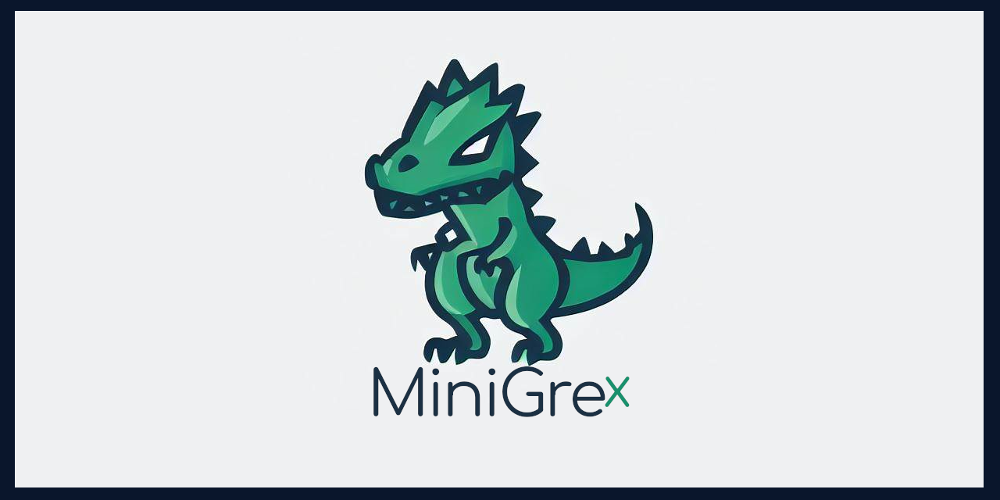

# Documentation of MiniGreX (CMS)

MiniGreX CMS has been designed with security in mind, and the code has been written to minimize the risk of SQL injection attacks and other security vulnerabilities. To ensure maximum security, we recommend keeping the CMS and your system up-to-date with the latest security patches and using strong passwords for all user accounts.

## Choose your language:
- [Deutsch](de/README.md)
- [English](en/README.md)
- Türkçe (soon)
